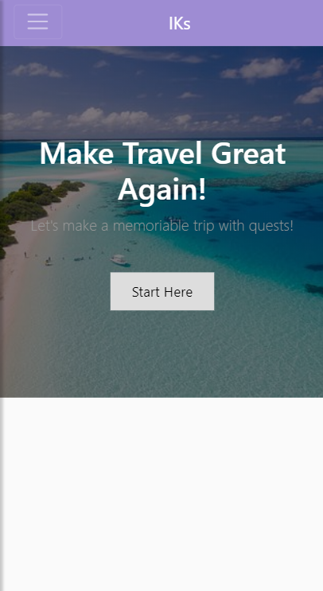
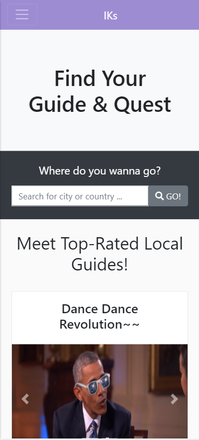
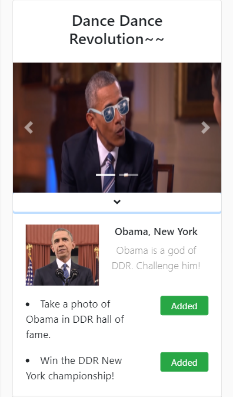
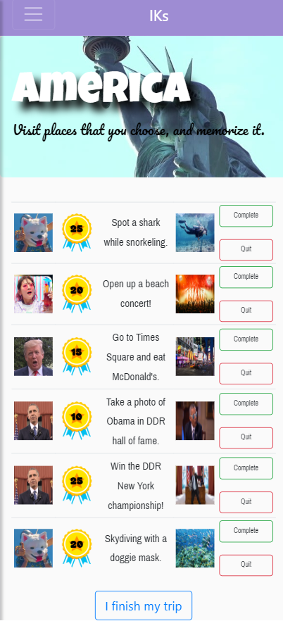
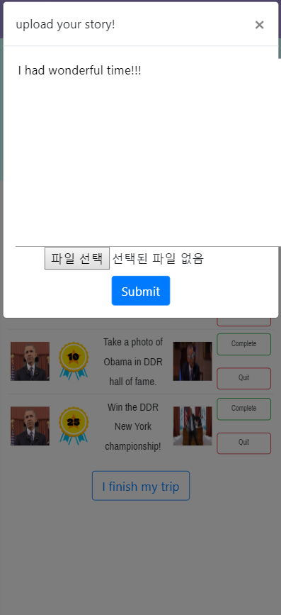
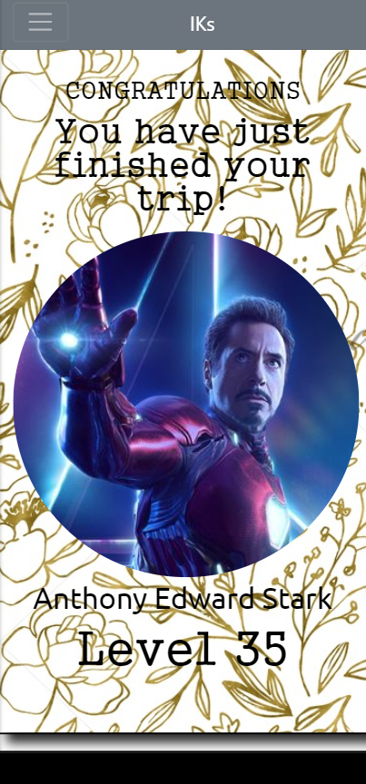
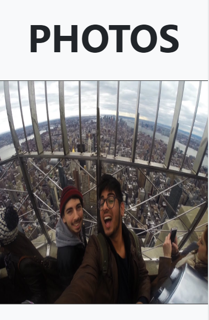
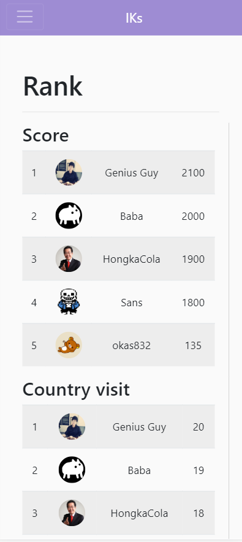
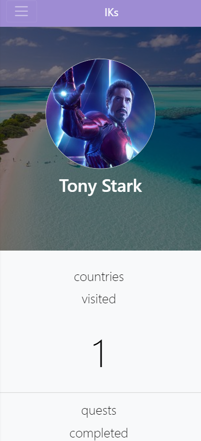

# CS374 - IKs - Mid-fi Prototype
This is a repository for Team IKs' Mid-fi prototype.

## Bootstrap CDN
Use this for linking bootstrap
```
<link rel="stylesheet" href="https://stackpath.bootstrapcdn.com/bootstrap/4.3.1/css/bootstrap.min.css" integrity="sha384-ggOyR0iXCbMQv3Xipma34MD+dH/1fQ784/j6cY/iJTQUOhcWr7x9JvoRxT2MZw1T" crossorigin="anonymous">
<script src="https://stackpath.bootstrapcdn.com/bootstrap/4.3.1/js/bootstrap.min.js" integrity="sha384-JjSmVgyd0p3pXB1rRibZUAYoIIy6OrQ6VrjIEaFf/nJGzIxFDsf4x0xIM+B07jRM" crossorigin="anonymous"></script>
```

## jQuery
Use this for jQuery
```
<script src="https://code.jquery.com/jquery-3.4.0.min.js"></script>
```

## Page Names

| Filename       | Page       |
| -------------- | ---------- |
| index.html     | Main Page  |
| myQuest.html   | Quest Page |
| rank.html      | Rank page  |
| mypage.html    | Mypage     |
| FindGuideQuest.html    | FindGuideQuest     |
| travel_summary.html    | travel summary page    |

## Contents

* Main page

    

    This is the main page of our website. The user can start by clicking 'start here'

  * Find Guides and Quest page

    

    User can find their quests provided by the guides.

    

    When the user click the image of the guide, the user can select quests provided by this guide.

    This page is related task 1, which is 'Plan travel with suggested quests'.

    

  * My Quest page

    

    User can check quests added on previous page. 

    

    

    When the users complete their quest, they can submit image of completion with simple diary. 

    This page is related task 2, which is 'Make memories during the journey with chosen quests.'

  * Travel Summary page

    

    When the users click 'I finish my trip' button on previous page, it shows the tracks of this trip. 

    

    Photos and diaries uploaded by the users on the previous page can be seen here. 

    This page is related to task 3, which is 'Look up your past track of the trip'

    

  * Ranking page

    

    Users can compare their stats with others in ranking page. 

    This page is related to task 4, which is 'Earn points on the trip, and compare with others'


​    

  * My page

    

    Users can check how many quests are cleared, and points are earned on my page. 

    This page is related to task 3, which is 'Look up your past track of the trip'


